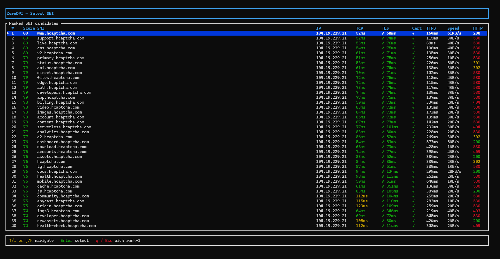
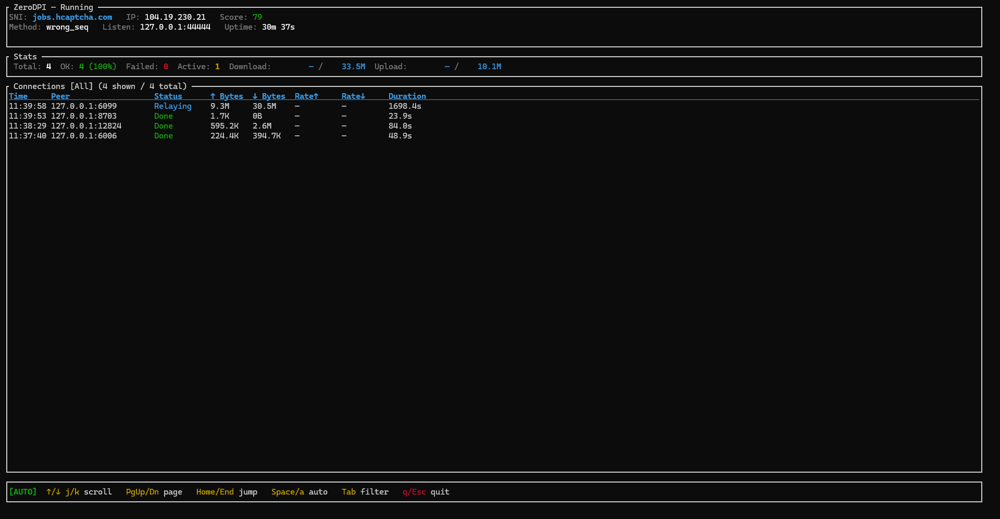
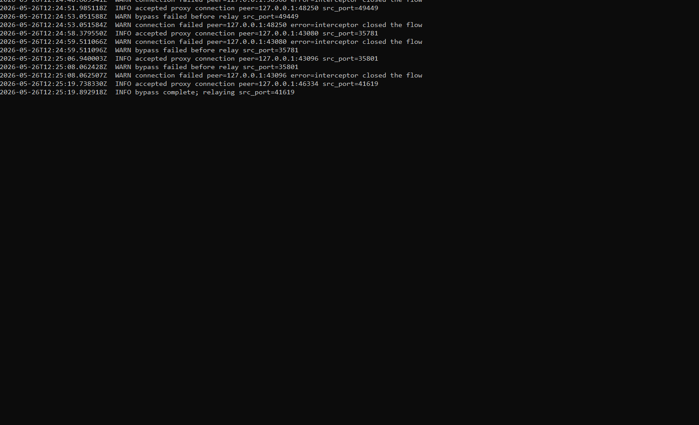

# 🛡️ ZeroDPI

> **Cross-platform DPI bypass proxy** — written in Rust, works on **Windows**, **Linux**, and **rooted Android/Termux**.

[](LICENSE)


ZeroDPI sits between your **upstream VPN app** (xray-core, sing-box, v2ray, Hysteria, etc.) and the internet, transparently evading **Deep Packet Inspection (DPI)** that would otherwise block or throttle your VPN traffic.

It is not a replacement VPN client. It is a local TCP relay that your existing VPN client connects to. Your VPN client still owns the VPN protocol, credentials, TLS settings, authentication, multiplexing, and routing rules; ZeroDPI only handles target selection, local relaying, and the DPI-bypass behavior applied at connection startup.

---

## Table of Contents

- [Features](#-features)
- [What ZeroDPI Does](#what-zerodpi-does)
- [Screenshots](#-screenshots)
- [Quick Start](#-quick-start)
- [First-Run Checklist](#first-run-checklist)
- [Requirements](#requirements)
- [Project Layout](#-project-layout)
- [Release Package Contents](#release-package-contents)
- [Choosing a Mode](#-choosing-a-mode)
- [Operating Modes](#-operating-modes)
- [Bypass Methods](#-bypass-methods)
- [Choosing a Bypass Method](#choosing-a-bypass-method)
- [Configuration Recipes](#-configuration-recipes)
- [Configuration Reference](#-configuration-reference)
- [Unified Probe Scoring](#-unified-probe-scoring-0100)
- [How Scanning Works](#how-scanning-works)
- [Scan Result JSON](#scan-result-json)
- [Interactive TUI](#-interactive-tui)
- [CLI Reference](#-cli-reference)
- [Integrating with Upstream VPN Apps](#-integrating-with-upstream-vpn-apps)
- [Choosing Decoy SNIs](#-choosing-decoy-snis-sni_listtxt)
- [IP List](#-ip-list-ip_listtxt)
- [Running](#-running)
- [Building from Source](#-building-from-source)
- [Testing](#-testing)
- [Known Limitations](#known-limitations)
- [Troubleshooting](#-troubleshooting)
- [Security & Privacy Checklist](#-security--privacy-checklist)
- [Extending](#-extending)
- [Credits](#-credits)
- [License](#-license)

---

## ✨ Features

| Feature | Description |
|---------|-------------|
| 🧩 **7 bypass methods** | `wrong_seq`, `wrong_checksum`, `wrong_ack`, `tls_record_frag`, `wrong_seq_tls_frag`, `wrong_seq_tls_record_frag`, `tcp_segmentation` |
| 🎯 **5 operating modes** | `sni_spoof`, `ip_bypass`, `sni_scan`, `ip_scan`, `proxy_scan` |
| 🖥️ **TUI dashboard** | Ratatui-powered live progress, selection tables, and connection monitoring |
| 🔄 **Auto-rescan** | Background re-scanning hot-swaps the best target without restart |
| 🧪 **Smart scoring** | Unified 0–100 composite score across TCP, TLS, TTFB, speed, and cert validity |
| ⚡ **Concurrent scanning** | Configurable concurrency per phase for fast results |
| 🔌 **Protocol agnostic** | Raw TCP relay — works with any TLS-based VPN protocol |
| 🪟 **Windows** | WinDivert packet interception |
| 🐧 **Linux / Android** | NFQUEUE packet interception, with selectable iptables/nftables rule setup on Linux |

---

## What ZeroDPI Does

ZeroDPI creates a local TCP listener, scans candidate targets, chooses a reachable target, then relays your VPN client's TCP stream to port `443` on the selected upstream IP. Depending on `BYPASS_METHOD`, it may also inject or rewrite the first connection packets so DPI devices see a harmless or fragmented TLS ClientHello instead of the VPN ClientHello they would normally block.

The normal connection path is:

```text
Your apps -> VPN client -> ZeroDPI local listener -> selected edge IP:443 -> real VPN service
```

ZeroDPI is useful when:

- Your VPN protocol already works when the network does not inspect or block the TLS handshake.
- Your upstream VPN profile is TCP + TLS based and can be configured to connect to `127.0.0.1:44444`.
- A CDN edge, relay IP, or public SNI candidate can reach the same service path you need.
- You want to scan many candidates and keep using the best one without manually editing the VPN profile each time.

ZeroDPI does not:

- Provide VPN accounts, proxy credentials, routing rules, DNS rules, or encryption by itself.
- Change the real TLS server name configured inside your VPN profile.
- Bypass every DPI implementation. Different networks require different methods and candidate lists.
- Support UDP-based VPN handshakes. The relay is TCP-focused and the current interceptor paths inspect IPv4 TCP packets.

Keep the upstream VPN profile's **real server name/SNI** in the VPN app. Change only the address and port that the VPN app dials so it connects to ZeroDPI's local listener.

---

## 📸 Screenshots

### Ranked SNI Selection



After an SNI scan, ZeroDPI shows a ranked table of candidates. Use it to compare score, latency, certificate validity, response speed, and HTTP behavior before selecting the target that new proxy connections should use.

### Live Connection Dashboard



The running dashboard confirms the active SNI/IP pair, current bypass method, local listener, uptime, connection state, byte counters, and recent relay activity. This is the main view for interactive desktop runs.

### Headless Service Logs



For systemd or other headless deployments, run with `--no-tui` and inspect logs instead of the terminal UI. The log stream shows accepted local proxy connections, bypass attempts, interceptor decisions, and successful handoff to the relay.

---

## 🚀 Quick Start

1. **Build or download ZeroDPI** for your platform.
2. **Edit `config.toml`** and choose a mode. Start with `MODE = "sni_spoof"` unless you know you need `ip_bypass` or a scan-only mode.
3. **Fill the input list**:
   - `sni_list.txt` for SNI-based modes.
   - `ip_list.txt` for IP-based modes.
4. **Run ZeroDPI with the required privileges**:

```sh
# Linux / rooted Android
sudo ./zerodpi --config ./config.toml
```

```powershell
# Windows Administrator terminal
.\zerodpi.exe --config .\config.toml
```

5. **Point your VPN client at ZeroDPI**, not directly at the remote VPN server. The default local endpoint is `127.0.0.1:44444`.
6. **Select a candidate** in the TUI, or set `AUTO_SELECT = true` / pass `--auto-select` for unattended startup.

For service deployments, combine `AUTO_SELECT = true` with `--no-tui` so the process can run without an interactive terminal.

---

## First-Run Checklist

Use this checklist when ZeroDPI starts but the VPN app still does not connect:

1. Confirm the VPN profile is TCP + TLS based. UDP-only profiles are outside ZeroDPI's relay path.
2. Keep the VPN profile's real TLS `serverName` / SNI unchanged.
3. Change the VPN profile's dial address to `127.0.0.1` and dial port to `44444` unless you changed `LISTEN_HOST` or `LISTEN_PORT`.
4. Put candidate public hostnames in `sni_list.txt` when using `sni_spoof`, `sni_scan`, or `proxy_scan`.
5. Put plain IPs or CIDR ranges in `ip_list.txt` when using `ip_bypass` or `ip_scan`.
6. Start ZeroDPI before starting or reconnecting the VPN client.
7. Run as Administrator/root for all interceptor methods except standalone `tcp_segmentation` and `ip_bypass`.
8. If the TUI is unavailable, pass `--auto-select --no-tui` and read logs instead.

For the first test, keep the candidate list small. A short list makes failures easier to understand and avoids creating unnecessary outbound probes while you are still checking the VPN profile wiring.

---

## Requirements

| Platform | Runtime Requirements | Notes |
|----------|----------------------|-------|
| Windows | Administrator terminal, `WinDivert.dll`, `WinDivert64.sys` next to `zerodpi.exe` | Required for interceptor methods. Standalone `tcp_segmentation` does not open WinDivert, but Administrator is still the safest first-run environment. |
| Linux | root or `CAP_NET_ADMIN`, NFQUEUE kernel support, `iptables` or `nft` depending on `LINUX_FIREWALL_BACKEND` | Interceptor methods install temporary firewall rules and remove them on shutdown. |
| Rooted Android / Termux | root, compatible kernel, `iptables` or `nft` for NFQUEUE methods | Try `tcp_segmentation` first if NFQUEUE support is uncertain. |
| All platforms | A TCP + TLS upstream VPN profile, reachable candidate SNIs or IPs, and permission to bind `LISTEN_HOST:LISTEN_PORT` | Default listener is `127.0.0.1:44444`. |

Build-time requirements are separate from runtime requirements. See [Building from Source](#-building-from-source) when compiling locally, and see [Release Package Contents](#release-package-contents) when using packaged artifacts.

---

## 🏗️ Project Layout

```
📦 zerodpi/
├── 📁 .cargo/                  # Cargo environment (WINDIVERT_PATH)
├── 📁 .github/
│   └── 📁 workflows/           # GitHub Actions release pipeline
├── 📁 crates/
│   ├── 📁 zerodpi-core/        # Platform-independent: config, TLS templates,
│   │                           #   flow tracking, bypass methods, scanners
│   ├── 📁 zerodpi-platform/    # Packet interception: WinDivert (win), NFQUEUE (nix)
│   └── 📁 zerodpi/             # CLI binary + ratatui TUI
├── 📄 AGENTS.md                # Contributor/AI agent guidelines
├── 📄 config.toml              # Configuration file
├── 📄 sni_list.txt             # Decoy CDN hostnames (sni_spoof mode)
├── 📄 ip_list.txt              # Relay IPs / CIDR ranges (ip_bypass mode)
├── 📄 install-systemd.sh       # Linux systemd service installer
├── 📁 images/                  # README screenshots
├── 📁 windivert/               # Windows: WinDivert.dll, .lib, .sys
└── 🐍 build.py                 # Cross-platform packaging script
```

---

## Release Package Contents

Packaged builds are designed to be run from the extracted directory. Keep the runtime files next to the executable unless you pass absolute paths in `config.toml`.

| Package | Expected Files |
|---------|----------------|
| Windows | `zerodpi.exe`, `WinDivert.dll`, `WinDivert64.sys`, `config.toml`, `sni_list.txt`, `ip_list.txt`, `README.md` |
| Linux | `zerodpi`, `config.toml`, `sni_list.txt`, `ip_list.txt`, `install-systemd.sh`, `README.md` |
| Termux | `zerodpi`, `config.toml`, `sni_list.txt`, `ip_list.txt`, `README.md` |

Relative paths in `config.toml` are resolved from the directory containing the config file. This matters for service installs: if `SNI_LIST = "sni_list.txt"`, the service expects `sni_list.txt` beside the same `config.toml` that was passed with `--config`.

When building with `python build.py`, outputs are staged under:

```text
dist/windows/
dist/linux/
dist/linux/<target>/
dist/termux/<arch>/
```

Copy or deploy the whole generated directory, not only the binary.

---

## 🧭 Choosing a Mode

| Goal | Recommended Mode | Notes |
|------|------------------|-------|
| Bypass DPI for a TLS VPN behind a CDN | `sni_spoof` | Best default. Scans SNI candidates, selects an SNI/IP pair, then relays VPN traffic. |
| Use a scanned relay IP without SNI spoofing | `ip_bypass` | No packet interception. Useful when you have IPs or CIDR ranges to test directly. |
| Audit SNI candidates only | `sni_scan` | Runs the SNI scanner, displays or saves results, then exits. |
| Audit IP/CIDR candidates only | `ip_scan` | Runs the IP scanner, displays or saves results, then exits. |
| Measure real VPN performance through an existing SOCKS5 client | `proxy_scan` | Tests candidates through V2RayN/sing-box and blends scanner score with end-to-end proxy results. |

Choose a bypass method separately with `BYPASS_METHOD`. If you cannot or do not want to use WinDivert/NFQUEUE packet interception, try `BYPASS_METHOD = "tcp_segmentation"` with `MODE = "sni_spoof"`.

Mode-specific inputs:

| Mode | Reads `SNI_LIST` | Reads `IP_LIST` | Starts Proxy | Uses `BYPASS_METHOD` |
|------|:---:|:---:|:---:|:---:|
| `sni_spoof` | Yes, unless `SELECTED_SNI` is set | No | Yes | Yes |
| `ip_bypass` | No | Yes, unless `SELECTED_IP` is set | Yes | No |
| `sni_scan` | Yes | No | No | No relay; scan only |
| `ip_scan` | No | Yes | No | No |
| `proxy_scan` | Yes | No | Temporary per-candidate tests | Yes, except standalone proxy scoring still depends on your SOCKS5 proxy |

`SELECTED_SNI` and `SELECTED_IP` are operational shortcuts. They skip scanning and are useful after you have already identified a stable candidate. They are not a replacement for periodic scan-only testing, because CDN routing and IP reachability can change.

---

## 🚀 Operating Modes

### 1️⃣ `sni_spoof` (default) — TLS SNI Spoofing

Injects a **decoy ClientHello** with a harmless CDN-hosted SNI (e.g. `auth.vercel.com`) that the DPI classifies as benign. The decoy uses a deliberately broken TCP sequence number, TCP acknowledgment number, or checksum so the real upstream server discards it — but the DPI has already passed the flow. Your real ClientHello then passes through unchallenged.

```
🖥️ Local apps → 🌐 VPN App → 🔄 ZeroDPI (sni_spoof) → 🌍 CDN Edge → 🖥️ VPN Server
                 TCP :44444                           TCP :443
```

**Use when:** Your VPN server sits behind a CDN and you have CDN-hosted hostnames.

---

### 2️⃣ `ip_bypass` — Pure TCP Relay

No packet interception, no SNI manipulation. Scans a list of IPs (or CIDR ranges), picks the best one via a 4-phase quality test, and relays all connections through it.

```
🖥️ Local apps → 🌐 VPN App → 🔄 ZeroDPI (ip_bypass) → 🌍 Selected IP :443
                 TCP :44444                           Raw TCP (SNI untouched)
```

**Use when:** No CDN hostname is available, or you just need a reliable relay point.

---

### 3️⃣ `sni_scan` — SNI Scan-Only

Runs the full SNI scan pipeline (same as `sni_spoof`), displays ranked results, optionally saves to JSON, then exits. **No proxy is started.**

**Use for:** Auditing `sni_list.txt` before deployment.

---

### 4️⃣ `ip_scan` — IP Scan-Only

Runs the full IP scan pipeline (same as `ip_bypass`), displays ranked results, optionally saves to JSON, then exits. **No proxy is started.**

**Use for:** Auditing `ip_list.txt` before deployment.

---

### 5️⃣ `proxy_scan` — End-to-End Proxy Scan 🔬

A two-phase hybrid scan:

1. **Phase 1** — Standard SNI scan (`sni_list.txt`)
2. **Phase 2** — For each passing candidate, opens a SOCKS5 connection through your running V2RayN/sing-box instance and measures real-world TCP latency, TTFB, and download speed

Results are blended using a configurable weight and displayed in the TUI.

**Use for:** Evaluating how each SNI candidate performs end-to-end through your actual proxy setup.

---

## 🧠 Bypass Methods

| Method | Mechanism | Requires Packet Interception? | Best For |
|--------|-----------|:---:|---|
| `wrong_seq` | Injects fake ClientHello with deliberately old TCP sequence number | ✅ Yes (WinDivert/NFQUEUE) | Most DPI systems |
| `wrong_checksum` | Injects fake ClientHello with corrupted TCP checksum | ✅ Yes | DPI that doesn't verify checksums |
| `wrong_ack` | Injects fake ClientHello with deliberately old TCP ACK number | ✅ Yes | DPI that accepts forged data but servers reject old ACKs |
| `tls_record_frag` | TLS Record Fragment: splits the real ClientHello record body into multiple tiny TLS records | ✅ Yes | DPI that can't reassemble TLS records |
| `wrong_seq_tls_frag` | Sends a wrong-sequence fake ClientHello, then writes the intact real ClientHello in tiny TCP segments | ✅ Yes | Layered TCP-segment DPI paths |
| `wrong_seq_tls_record_frag` | Sends a wrong-sequence fake ClientHello, then splits the real ClientHello body into tiny TLS records | ✅ Yes | Layered TLS-record DPI paths |
| `tcp_segmentation` | TLS Fragment: writes an intact ClientHello record in tiny TCP segments | ❌ No | DPI that inspects individual TCP segments |

---

## Choosing a Bypass Method

Start with the least complex method that can run on your platform, then move to stronger or more specific methods only when needed.

| Situation | Try |
|-----------|-----|
| Windows or Linux desktop with Administrator/root access | `wrong_seq` first |
| Rooted Android where NFQUEUE support is uncertain | `tcp_segmentation` first |
| You cannot run packet interception but can point the VPN client at ZeroDPI | `tcp_segmentation` |
| DPI appears to ignore invalid sequence tricks | `wrong_ack`, `wrong_checksum`, or `tls_record_frag` |
| DPI sees through fake packets but fails with fragmented real handshakes | `tls_record_frag` |
| A first firewall layer is fooled, but another layer still blocks the real ClientHello | `wrong_seq_tls_frag` or `wrong_seq_tls_record_frag` |
| You only need the fastest reachable IP and not SNI spoofing | `MODE = "ip_bypass"` |

Method behavior in more detail:

- `wrong_seq`, `wrong_ack`, and `wrong_checksum` send a fake decoy ClientHello during the TCP handshake path. DPI may inspect it, but the real upstream server should discard it.
- `tls_record_frag` rewrites the real first TLS record into many smaller TLS records. The server should reassemble the TLS handshake normally.
- `tcp_segmentation` keeps the TLS bytes unchanged and writes them in small TCP chunks from the proxy. It avoids WinDivert/NFQUEUE and is the easiest method to run in restricted environments.
- The `wrong_seq_*` combo methods first send the decoy wrong-sequence ClientHello, then also fragment the real ClientHello path.

If a method works but connection setup is slow, increase fragment sizes gradually (`TCP_SEG_SIZE`, `TLS_RECORD_FRAG_SIZE`) or try a higher-scoring SNI/IP. Very small fragments are aggressive and can add connection-start overhead.

---

## 🧪 Configuration Recipes

### Default SNI Spoofing

Use this when your VPN server is reachable through a CDN edge and you have candidate hostnames in `sni_list.txt`.

```toml
MODE = "sni_spoof"
LISTEN_HOST = "127.0.0.1"
LISTEN_PORT = 44444
SNI_LIST = "sni_list.txt"
BYPASS_METHOD = "wrong_seq"
AUTO_SELECT = false
```

Run ZeroDPI, select a high-scoring SNI, then configure your VPN client to connect to `127.0.0.1:44444`.

### Headless / Service Run

Use this for systemd, scheduled startup, or remote machines where no terminal UI is available.

```toml
MODE = "sni_spoof"
AUTO_SELECT = true
RESCAN_INTERVAL_SECS = 300
SNI_SWITCH_MIN_SCORE = 40
RELAY_MAX_LIFETIME_SECS = 0
```

Start the process with:

```sh
./zerodpi --config ./config.toml --auto-select --no-tui
```

### Packet-Interception-Free TCP-Level TLS Fragment

Use this when WinDivert/NFQUEUE is unavailable or you want TCP-level TLS Fragment behavior that operates entirely inside the proxy.

```toml
MODE = "sni_spoof"
BYPASS_METHOD = "tcp_segmentation"
TCP_SEG_SIZE = 1
TCP_SEG_NODELAY = true
```

This still requires your VPN client to connect to ZeroDPI's local listener. The TLS layer stays intact; ZeroDPI only controls how the ClientHello bytes are written into TCP segments.

### Scan Only and Save Results

Use scan-only modes to prepare candidate lists before a production run.

```toml
MODE = "sni_scan"
SNI_LIST = "sni_list.txt"
SCAN_OUTPUT = "sni-results.json"
```

```toml
MODE = "ip_scan"
IP_LIST = "ip_list.txt"
SCAN_OUTPUT = "ip-results.json"
```

### IP Bypass

Use this when you want ZeroDPI to pick a working IP from `ip_list.txt` and relay raw TCP without SNI spoofing.

```toml
MODE = "ip_bypass"
IP_LIST = "ip_list.txt"
IP_SCAN_SNI = "cloudflare.com"
AUTO_SELECT = true
```

### Fixed Candidate After a Successful Scan

Use this after you have already run `sni_scan` and want deterministic startup without scanning every time.

```toml
MODE = "sni_spoof"
SELECTED_SNI = "auth.vercel.com"
BYPASS_METHOD = "wrong_seq"
AUTO_SELECT = true
```

ZeroDPI resolves `SELECTED_SNI` at startup and creates synthetic score-0 entries because it intentionally skips the probe phases. If the hostname stops resolving or the selected edge stops working, clear `SELECTED_SNI` and run the scanner again.

For `ip_bypass`, use a fixed IP instead:

```toml
MODE = "ip_bypass"
SELECTED_IP = "104.16.132.229"
```

### Proxy Scan Through an Existing SOCKS5 Client

Use this when V2RayN, sing-box, or another local client already exposes a SOCKS5/mixed port and you want to measure candidate performance through the full VPN stack.

```toml
MODE = "proxy_scan"
SNI_LIST = "sni_list.txt"
PROXY_TEST_SOCKS5_HOST = "127.0.0.1"
PROXY_TEST_SOCKS5_PORT = 10808
PROXY_TEST_MIN_SNI_SCORE = 20
PROXY_TEST_TOP_N = 20
PROXY_TEST_SNI_WEIGHT = 0.5
```

Start the SOCKS5 client first, then run ZeroDPI in `proxy_scan` mode. This mode exits after displaying or saving results.

### Allow Another Device to Use ZeroDPI

Use this only on trusted networks. It allows another device on your LAN to point its VPN client at the machine running ZeroDPI.

```toml
LISTEN_HOST = "0.0.0.0"
LISTEN_PORT = 44444
```

Open the local firewall for `LISTEN_PORT`, then configure the other device's VPN client to dial the ZeroDPI machine's LAN IP. Keep this private; exposing the listener publicly can create an unintended open relay.

---

## ⚙️ Configuration Reference

All fields go in `config.toml` (loaded from the binary's directory, or via `--config <path>`). Every field has a sensible default — start minimal and override as needed.

### 🔌 Proxy Listener

| Field | Type | Default | Description |
|-------|------|---------|-------------|
| `LISTEN_HOST` | `string` | `"127.0.0.1"` | IP address to bind the local TCP proxy |
| `LISTEN_PORT` | `u16` | `44444` | TCP port for the local proxy |

### 🎮 Operating Mode

| Field | Type | Default | Description |
|-------|------|---------|-------------|
| `MODE` | `string` | `"sni_spoof"` | One of: `sni_spoof`, `ip_bypass`, `sni_scan`, `ip_scan`, `proxy_scan` |
| `AUTO_SELECT` | `bool` | `false` | Auto-pick rank-1 after scan (skip manual selection table) |
| `SELECTED_SNI` | `string` | — | Skip SNI scan; use this hostname directly |
| `SELECTED_IP` | `string` | — | Skip IP scan; use this IP directly |

### 📂 Input Files

| Field | Type | Default | Description |
|-------|------|---------|-------------|
| `SNI_LIST` | `string` | `"sni_list.txt"` | Path to decoy SNI hostname file (one per line) |
| `IP_LIST` | `string` | `"ip_list.txt"` | Path to IP list file (plain IPs or CIDR ranges) |

### 🔍 Scan Behavior

| Field | Type | Default | Description |
|-------|------|---------|-------------|
| `SCAN_TIMEOUT_SECS` | `u64` | `5` | Per-probe timeout (seconds) |
| `RESCAN_INTERVAL_SECS` | `u64` | `0` | Background rescan interval (`0` = disabled) |
| `SNI_SWITCH_MIN_SCORE` | `u8` | `1` | Minimum score to auto-switch target on rescan (0–100) |
| `SCAN_OUTPUT` | `string` | — | Path to save scan results as JSON (scan-only modes) |

### ⚡ Scanner Tuning

| Field | Type | Default | Description |
|-------|------|---------|-------------|
| `SNI_MAX_CONCURRENT` | `usize` | `64` | Max concurrent SNI probes |
| `IP_MAX_P1_CONCURRENT` | `usize` | `128` | Max concurrent TCP connections in IP phase 1 |
| `IP_MAX_P2_CONCURRENT` | `usize` | `32` | Max concurrent TLS probes in IP phase 2 |
| `SCAN_DOWNLOAD_CAP` | `usize` | `10240` | Max bytes downloaded for speed tests |
| `IP_SCAN_SNI` | `string` | `"cloudflare.com"` | SNI used during IP scan TLS phase only |
| `IPV6_MAX_HOSTS` | `u64` | `65536` | Max hosts expanded from a single IPv6 CIDR |

### 📊 Scoring Parameters

| Field | Type | Default | Description |
|-------|------|---------|-------------|
| `TCP_LATENCY_CAP_MS` | `f64` | `500.0` | TCP latency cap for scoring (ms) |
| `TLS_LATENCY_CAP_MS` | `f64` | `1000.0` | TLS handshake latency cap (ms) |
| `TTFB_CAP_MS` | `f64` | `2000.0` | Time-to-first-byte cap (ms) |
| `SPEED_CAP_BPS` | `f64` | `2048000` | Download speed cap for scoring (bytes/sec) |

### 🛠️ Bypass Engine

| Field | Type | Default | Description |
|-------|------|---------|-------------|
| `BYPASS_METHOD` | `string` | `"wrong_seq"` | `wrong_seq`, `wrong_checksum`, `wrong_ack`, `tls_record_frag`, `wrong_seq_tls_frag`, `wrong_seq_tls_record_frag`, or `tcp_segmentation` |
| `BYPASS_TIMEOUT_SECS` | `u64` | `2` | Time to wait for bypass setup before giving up |
| `RELAY_MAX_LIFETIME_SECS` | `u64` | `0` | Rotate established relays after this many seconds (`0` = disabled/default) |
| `NFQUEUE_NUM` | `u16` | `1` | (Linux) NFQUEUE queue number |
| `LINUX_FIREWALL_BACKEND` | `string` | `"iptables"` | (Linux) Rule backend: `iptables` or `nftables` |

#### `wrong_seq` Parameters

| Field | Type | Default | Description |
|-------|------|---------|-------------|
| `WRONG_SEQ_EXTRA_OFFSET` | `u32` | `0` | Extra bytes subtracted from injected TCP seq number |
| `WRONG_SEQ_SET_PSH` | `bool` | `true` | Set PSH flag on the spoofed packet |
| `WRONG_SEQ_BUMP_IP_IDENT` | `bool` | `true` | Bump IPv4 Identification field |

#### `wrong_checksum` Parameters

| Field | Type | Default | Description |
|-------|------|---------|-------------|
| `WRONG_CHECKSUM_DELTA` | `u16` | `1` | Value added to corrupt TCP checksum (≥ 1) |
| `WRONG_CHECKSUM_SET_PSH` | `bool` | `true` | Set PSH flag on the spoofed packet |
| `WRONG_CHECKSUM_BUMP_IP_IDENT` | `bool` | `true` | Bump IPv4 Identification field |
| `WRONG_CHECKSUM_COMPLETE_IMMEDIATELY` | `bool` | `true` | Signal bypass complete immediately after emission |

#### `wrong_ack` Parameters

| Field | Type | Default | Description |
|-------|------|---------|-------------|
| `WRONG_ACK_OFFSET` | `u32` | `1` | Bytes subtracted from `syn_ack_seq + 1` for the spoofed TCP ACK (>= 1) |
| `WRONG_ACK_SET_PSH` | `bool` | `true` | Set PSH flag on the spoofed packet |
| `WRONG_ACK_BUMP_IP_IDENT` | `bool` | `true` | Bump IPv4 Identification field |
| `WRONG_ACK_COMPLETE_IMMEDIATELY` | `bool` | `true` | Signal bypass complete immediately after emission |

#### `tls_record_frag` Parameters

| Field | Type | Default | Description |
|-------|------|---------|-------------|
| `TLS_RECORD_FRAG_SIZE` | `usize` | `1` | Max TLS record body bytes per TLS record fragment (≥ 1) |
| `TLS_RECORD_FRAG_SET_PSH` | `bool` | `true` | Set PSH flag on the fragmented packet |
| `TLS_RECORD_FRAG_BUMP_IP_IDENT` | `bool` | `true` | Bump IPv4 Identification field |

`wrong_seq_tls_record_frag` uses both the `wrong_seq` and `tls_record_frag` parameter groups.

#### `tcp_segmentation` Parameters

| Field | Type | Default | Description |
|-------|------|---------|-------------|
| `TCP_SEG_SIZE` | `usize` | `1` | Max intact ClientHello bytes per TCP segment (≥ 1) |
| `TCP_SEG_NODELAY` | `bool` | `true` | Enable TCP_NODELAY to prevent Nagle coalescing |

`wrong_seq_tls_frag` uses both the `wrong_seq` and `tcp_segmentation` parameter groups.

### 🔬 Proxy Scan Mode (`proxy_scan`)

| Field | Type | Default | Description |
|-------|------|---------|-------------|
| `PROXY_TEST_MIN_SNI_SCORE` | `u8` | `1` | Min Phase-1 score to enter Phase 2 |
| `PROXY_TEST_TOP_N` | `usize` | `0` | Max candidates to carry into Phase 2 (`0` = all) |
| `PROXY_TEST_SOCKS5_HOST` | `string` | `"127.0.0.1"` | SOCKS5 proxy host |
| `PROXY_TEST_SOCKS5_PORT` | `u16` | `10808` | SOCKS5 proxy port |
| `PROXY_TEST_URL` | `string` | `"https://speed.cloudflare.com/__down?bytes=524288"` | HTTPS URL for speed test |
| `PROXY_TEST_TIMEOUT_SECS` | `u64` | `30` | Per-proxy-test probe timeout |
| `PROXY_TEST_SNI_WEIGHT` | `f64` | `0.5` | SNI-score blend weight (0.0–1.0) |
| `PROXY_TEST_LATENCY_CAP_MS` | `f64` | `500.0` | Proxy TCP latency cap (ms) |
| `PROXY_TEST_TTFB_CAP_MS` | `f64` | `3000.0` | Proxy TTFB cap (ms) |
| `PROXY_TEST_SPEED_CAP_BPS` | `f64` | `2048000` | Proxy speed cap (bytes/sec) |

---

## 📊 Unified Probe Scoring (0–100)

Both the SNI and IP scanners use the same scoring formula. Each `(SNI, IP)` pair or plain IP is evaluated across phases:

| Component | Max Pts | Formula |
|-----------|:-------:|---------|
| ✅ TCP latency | **25** | Linear: 0 ms → 25 pts, ≥ `TCP_LATENCY_CAP_MS` → 0 pts |
| 🔒 TLS success | **10** | Flat bonus for a successful TLS handshake |
| ⏱️ TLS latency | **15** | Linear: 0 ms → 15 pts, ≥ `TLS_LATENCY_CAP_MS` → 0 pts |
| 🏷️ Cert valid | **5** | Flat bonus for valid certificate (Mozilla roots via `webpki-roots`) |
| 🚀 TTFB | **20** | Linear: 0 ms → 20 pts, ≥ `TTFB_CAP_MS` → 0 pts |
| ⚡ Download speed | **15** | Linear: 0 B/s → 0 pts, ≥ `SPEED_CAP_BPS` → 15 pts |
| 🏆 All phases bonus | **10** | All five signals present |

**Tiebreaker:** Score (desc) → TCP latency (asc).

- **SNI probe endpoint:** `GET /` on each resolved IPv4 address.
- **IP probe endpoint:** `GET /cdn-cgi/trace` with `IP_SCAN_SNI` in the `Host` header.

---

## How Scanning Works

The scanners are quality filters, not bypass methods. They help ZeroDPI choose a target before the relay starts.

### SNI scanner

`sni_scan`, `sni_spoof`, and Phase 1 of `proxy_scan` read `sni_list.txt`, ignore blank lines and `#` comments, resolve each hostname, and probe every resolved IPv4 address. For each `(SNI, IP)` pair, ZeroDPI measures:

1. DNS resolution to IPv4 addresses.
2. TCP connect latency to `ip:443`.
3. TLS handshake success and TLS latency using the candidate hostname as SNI.
4. Certificate validity through the bundled Mozilla root store from `webpki-roots`.
5. HTTP `GET /` time-to-first-byte.
6. Download speed up to `SCAN_DOWNLOAD_CAP` bytes.
7. HTTP status code from the first response line.

The result list is sorted by score descending, then TCP latency ascending. A high score usually means the candidate is reachable, fast, and able to complete normal TLS/HTTP checks from your network.

### IP scanner

`ip_scan` and `ip_bypass` read `ip_list.txt`, ignore blank lines and `#` comments, accept plain IPv4/IPv6 addresses, and expand CIDR ranges. IPv4 CIDRs are expanded in full; IPv6 CIDRs are capped by `IPV6_MAX_HOSTS`.

The IP scanner runs a pipelined flow:

1. Phase 1: TCP connect to each IP on port `443`.
2. Phase 2: TLS handshake using `IP_SCAN_SNI`.
3. Phase 3: HTTP `GET /cdn-cgi/trace`.
4. Phase 4: small download sample up to `SCAN_DOWNLOAD_CAP`.

`IP_SCAN_SNI` is only used for the scan's TLS/HTTP probe. It is not inserted into real proxied VPN traffic in `ip_bypass`; the upstream VPN client's own TLS handshake passes through unchanged.

### Proxy scanner

`proxy_scan` first runs the SNI scanner, filters candidates using `PROXY_TEST_MIN_SNI_SCORE` and `PROXY_TEST_TOP_N`, then tests each survivor through `PROXY_TEST_SOCKS5_HOST:PROXY_TEST_SOCKS5_PORT`. This is useful when raw SNI reachability is not enough and you want to measure behavior through your actual local VPN/proxy client.

The final `proxy_scan` score blends:

```text
final_score = SNI scan score * PROXY_TEST_SNI_WEIGHT
            + proxy test score * (1.0 - PROXY_TEST_SNI_WEIGHT)
```

---

## Scan Result JSON

Set `SCAN_OUTPUT` in scan-only modes to save results:

```toml
MODE = "sni_scan"
SCAN_OUTPUT = "sni-results.json"
```

SNI scan results are an array of objects like:

```json
[
  {
    "sni": "auth.vercel.com",
    "ip": "76.76.21.21",
    "tcp_latency_ms": 42,
    "tls_ok": true,
    "tls_latency_ms": 88,
    "cert_valid": true,
    "ttfb_ms": 140,
    "speed_bps": 1048576.0,
    "http_status": 200,
    "score": 91
  }
]
```

IP scan results are similar, but the object starts with `ip` and has no `sni` field:

```json
[
  {
    "ip": "104.16.132.229",
    "tcp_latency_ms": 35,
    "tls_ok": true,
    "tls_latency_ms": 70,
    "cert_valid": true,
    "ttfb_ms": 120,
    "speed_bps": 2048000.0,
    "http_status": 200,
    "score": 96
  }
]
```

Failed phases are stored as `null` for optional numeric fields and `false` for boolean success flags. A low score is still useful: it tells you whether the candidate failed at TCP, TLS, HTTP, or speed measurement.

---

## 🖥️ Interactive TUI

ZeroDPI uses [ratatui](https://github.com/ratatui-org/ratatui) for a live terminal UI in every mode:

| Mode | View 1 | View 2 | View 3 |
|------|--------|--------|--------|
| `sni_spoof` | 📊 Scan progress (Score · SNI · IP · TCP · TLS · TTFB · Speed · HTTP) | 🎯 Selection table | 📈 Dashboard |
| `ip_bypass` | 📊 IP scan progress | 🎯 Selection table | 📈 Dashboard |
| `sni_scan` | 📊 Scan progress | 📋 Results table (view-only) | — |
| `ip_scan` | 📊 IP scan progress | 📋 Results table (view-only) | — |
| `proxy_scan` | 📊 Phase 1 + Phase 2 progress | 📋 Blended results table | — |

**Navigation:** `↑`/`↓` or `j`/`k` to move, `Enter` to confirm, `q`/`Esc` to skip to rank-1.

---

## 💻 CLI Reference

```
zerodpi [OPTIONS]

Options:
  -c, --config <PATH>                  Path to config.toml
      --listen-host <HOST>             Override LISTEN_HOST
      --listen-port <PORT>             Override LISTEN_PORT
      --auto-select                    Auto-select top-ranked candidate
      --no-tui                         Disable ratatui screens for headless/service runs
      --sni <SNI>                      Override SELECTED_SNI (skip scan)
      --method <METHOD>                Override BYPASS_METHOD (e.g. wrong_seq, wrong_ack, tcp_segmentation)
      --queue-num <N>                  Override NFQUEUE_NUM (Linux)
      --scan-timeout <SECS>            Override SCAN_TIMEOUT_SECS
      --rescan-interval <SECS>         Override RESCAN_INTERVAL_SECS
      --sni-switch-min-score <SCORE>   Override SNI_SWITCH_MIN_SCORE
      --wrong-seq-extra-offset <N>     Override WRONG_SEQ_EXTRA_OFFSET
      --wrong-seq-no-psh               Clear PSH flag (sets WRONG_SEQ_SET_PSH=false)
      --wrong-seq-no-bump-ident        Skip IPv4 ID bump (sets WRONG_SEQ_BUMP_IP_IDENT=false)
      --bypass-timeout <SECS>          Override BYPASS_TIMEOUT_SECS
      --relay-max-lifetime <SECS>      Override RELAY_MAX_LIFETIME_SECS
  -h, --help                           Print help
  -V, --version                        Print version
```

---

## 🧩 Integrating with Upstream VPN Apps

Configure your VPN app to point to `LISTEN_HOST:LISTEN_PORT` (default: `127.0.0.1:44444`) instead of your actual VPN server. ZeroDPI handles the DPI bypass and relays the raw TCP stream.

In most clients this means:

| VPN Profile Field | Set To |
|-------------------|--------|
| Server address / host / endpoint | `127.0.0.1` or your configured `LISTEN_HOST` |
| Server port | `44444` or your configured `LISTEN_PORT` |
| TLS server name / SNI / peer name | The real VPN server name from your provider/profile |
| UUID/password/private key/path/header settings | Keep unchanged |
| Transport protocol | TCP + TLS compatible transport |

ZeroDPI's local listener is a raw TCP relay, not a SOCKS5 server. Do not configure your VPN client to use ZeroDPI as an HTTP/SOCKS proxy unless that client mode still opens the actual VPN TCP stream to `LISTEN_HOST:LISTEN_PORT`.

<details>
<summary><b>xray-core</b> (click to expand)</summary>

```json
{
  "outbounds": [
    {
      "tag": "proxy",
      "protocol": "vless",
      "settings": {
        "vnext": [
          {
            "address": "127.0.0.1",
            "port": 44444,
            "users": [{ "id": "<uuid>", "encryption": "none" }]
          }
        ]
      },
      "streamSettings": {
        "network": "tcp",
        "security": "tls",
        "tlsSettings": {
          "serverName": "your.vpn.domain.com"
        }
      }
    }
  ]
}
```
</details>

<details>
<summary><b>sing-box</b> (click to expand)</summary>

```json
{
  "outbounds": [
    {
      "type": "vless",
      "tag": "proxy",
      "server": "127.0.0.1",
      "server_port": 44444,
      "uuid": "<uuid>",
      "tls": {
        "enabled": true,
        "server_name": "your.vpn.domain.com"
      }
    }
  ]
}
```
</details>

**Protocol agnostic** — ZeroDPI relays raw TCP bytes. Any TLS-based VPN protocol works.

---

## 📝 Choosing Decoy SNIs (`sni_list.txt`)

1. **Same CDN** — Decoy hostnames must resolve to CDN edge IPs that also terminate your VPN server domain.
2. **Low latency** — ZeroDPI ranks candidates automatically; pick from the top.
3. **Public, harmless hostnames** — Use hostnames that are normal to access from your network and do not expose your private services.
4. **Keep it current** — CDN routing changes. Re-run `sni_scan` periodically and remove candidates that stop completing TCP/TLS/HTTP probes.
5. **Avoid secrets** — Do not put private VPN domains, credentials, customer domains, or internal hostnames in a list you plan to publish.

```
# Example sni_list.txt
cloudflare.com
auth.vercel.com
www.fastly.com
```

For a first pass, keep the list small enough to understand the results. After you know which CDN family works on your network, expand the list and use `SNI_MAX_CONCURRENT` to control scan speed.

Interpreting SNI results:

- **High TCP score but failed TLS** usually means the IP is reachable but the hostname/IP pair is not a valid TLS target for that SNI.
- **TLS succeeds but TTFB is missing** can mean the edge accepts TLS but does not serve HTTP for the probe path.
- **Good score but VPN still fails** usually points to VPN-profile wiring, a mismatch between CDN/service routing, or a bypass method that does not work on that network.
- **Many candidates fail at DNS** means the list contains stale hostnames, blocked hostnames, or names unavailable from the current resolver.

Comments are allowed:

```text
# Cloudflare-family candidates
cloudflare.com

# Vercel-family candidates
auth.vercel.com
```

---

## 📝 IP List (`ip_list.txt`)

```
# Plain IPv4
104.16.132.229
# Plain IPv6
2606:4700::6810:84e5
# IPv4 CIDR
104.16.0.0/24
# IPv6 CIDR (capped at IPV6_MAX_HOSTS)
2606:4700::/32
```

Hostnames are silently skipped — IPs and CIDRs only.

Large CIDR ranges can take time and create many outbound probes. Start with narrow ranges, keep `IP_MAX_P1_CONCURRENT` conservative on slow networks, and use `IPV6_MAX_HOSTS` to cap IPv6 expansion.

CIDR expansion can create far more probes than expected:

| Entry | Approximate Probes |
|-------|--------------------|
| `104.16.0.0/30` | 2 IPv4 host addresses |
| `104.16.0.0/24` | 254 IPv4 host addresses |
| `104.16.0.0/16` | 65,534 IPv4 host addresses |
| `2606:4700::/64` | Capped by `IPV6_MAX_HOSTS` |

Use scan-only mode first when testing a new range:

```toml
MODE = "ip_scan"
IP_LIST = "ip_list.txt"
SCAN_OUTPUT = "ip-results.json"
```

---

## 🏃 Running

Before starting ZeroDPI:

- Make sure your VPN client is configured to connect to `LISTEN_HOST:LISTEN_PORT`.
- Make sure the real VPN server name is still configured inside your VPN profile's TLS settings.
- Use an Administrator/root shell for interceptor-based methods.
- Use `--no-tui` for services, SSH sessions without a proper terminal, and log-only operation.

Runtime behavior to know:

- ZeroDPI currently relays to upstream port `443`.
- Interceptor-based methods inspect IPv4 TCP packets in the current backends.
- `tcp_segmentation` does not open WinDivert/NFQUEUE because it operates by controlling socket writes inside the proxy.
- Scan-only modes do not start the local proxy and do not need your VPN client to be running.
- `proxy_scan` requires the configured SOCKS5 proxy to be running before ZeroDPI starts Phase 2.

### 🐧 Linux

```sh
sudo ./zerodpi --config ./config.toml
```

Requires `CAP_NET_ADMIN` (or root), NFQUEUE kernel support, and the selected firewall command. By default ZeroDPI uses `iptables`; set `LINUX_FIREWALL_BACKEND = "nftables"` to use the `nft` command instead. Rules are installed on startup and **automatically removed on shutdown** for interceptor-based methods.

```toml
LINUX_FIREWALL_BACKEND = "nftables"
```

#### systemd service installer

`install-systemd.sh` exists for Linux servers and headless machines where ZeroDPI should start at boot and keep running without an interactive terminal. It installs ZeroDPI as a native `systemd` service instead of requiring you to keep a root shell open. It is not needed for interactive desktop runs, Windows, or Android/Termux.

Run it from the same directory as the ZeroDPI release files:

```sh
sudo ./install-systemd.sh
systemctl status zerodpi.service
journalctl -u zerodpi.service -f
```

Before running the installer, edit `config.toml`, `sni_list.txt`, and `ip_list.txt` in that directory. The installer requires root, `systemctl`, a running systemd instance, a ZeroDPI executable, and `config.toml` next to the script.

The installer:

- Finds the ZeroDPI executable in the script directory (`zerodpi` or `zerodpi-*`).
- Uses that directory as the service `WorkingDirectory`, so relative config/list paths resolve there.
- Verifies the generated unit with `systemd-analyze verify` when that command is available.
- Warns if `sni_list.txt` or `ip_list.txt` is missing, and makes the binary executable.
- Writes `/etc/systemd/system/zerodpi.service`.
- Runs the service as `root`, which is required for NFQUEUE-based bypass methods.
- Starts ZeroDPI with the resolved binary and config paths plus `--auto-select --no-tui`.
- Sets `RUST_LOG=info`, sends output to journald, restarts on failure, reloads systemd, enables the service at boot, and starts it immediately.

The generated unit deliberately runs with `--auto-select --no-tui` because services cannot wait for keyboard selection or render the TUI. Use `journalctl -u zerodpi.service -f` to watch scan results, selected candidates, bypass attempts, and relay activity.

Useful service commands:

```sh
sudo systemctl restart zerodpi.service
sudo systemctl stop zerodpi.service
sudo systemctl disable --now zerodpi.service
sudo systemctl daemon-reload
```

If you move the release directory, binary, or config file after installation, rerun `sudo ./install-systemd.sh` from the new directory so the unit points at the correct paths. The installer rejects paths containing whitespace, quotes, backslashes, or `%` characters because those are unsafe in the generated systemd unit.

### 🪟 Windows

```powershell
.\zerodpi.exe --config .\config.toml
```

Run from an **Administrator** prompt. Requires `WinDivert.dll` and `WinDivert64.sys` next to the EXE.

If Windows blocks the driver or DLL, unblock the downloaded archive before extracting it, then run the terminal as Administrator. Keep the `windivert/` runtime files next to the executable when packaging manually.

### 📱 Android / Termux

```sh
./zerodpi --config ./config.toml
```

Requires root, a supported firewall backend command (`iptables` by default, or `nft` with `LINUX_FIREWALL_BACKEND = "nftables"`), and a kernel with NFQUEUE support.

On Android, `tcp_segmentation` is the simplest method to try first because it does not require NFQUEUE interception. Interceptor-based methods still need root and a compatible kernel.

---

## 🔨 Building from Source

Requires **Rust 1.75+** (MSRV). The workspace targets the 2021 edition.

```sh
cargo build --release
```

The plain Cargo build writes binaries under `target/release/`. The packaging helper copies the binary plus runtime files into `dist/` so the result is easier to deploy.

```sh
# Auto-detect Linux/Windows host where supported
python build.py

# Explicit platform
python build.py --platform linux
python build.py --platform windows
python build.py --platform termux

# Build all supported package families from one host where toolchains exist
python build.py --platform all
```

<details>
<summary><b>Linux</b> (click to expand)</summary>

```sh
sudo apt-get install libnetfilter-queue-dev
cargo build --release
```

Linux packaging:

```sh
python build.py --platform linux
```

Windows hosts can cross-compile Linux packages through `cargo-zigbuild` when Zig and the Rust targets are installed:

```sh
python build.py --platform linux --linux-target x86_64
python build.py --platform linux --linux-target aarch64
python build.py --platform linux --linux-target all
```
</details>

<details>
<summary><b>Windows</b> (click to expand)</summary>

Requires MSYS2 and the GNU toolchain. When using `build.py`, WinDivert is downloaded into the repo-local `windivert/` folder automatically.

```powershell
cargo +stable-x86_64-pc-windows-gnu build --release
```

Or use the build script:

```sh
python build.py --platform windows
```

Useful Windows build options:

```sh
python build.py --platform windows --windivert-version 2.2.2
python build.py --platform windows --toolchain stable-x86_64-pc-windows-gnu
python build.py --platform windows --msys2-path C:\msys64
```
</details>

<details>
<summary><b>Android / Termux</b> (click to expand)</summary>

```sh
python build.py --platform termux --termux-arch all --android-ndk /path/to/android-ndk
```

Use `--termux-arch armv7` or `--termux-arch armv8` to build one Android ARM package. Output is staged under `dist/termux/<arch>/`.

Additional Termux options:

```sh
python build.py --platform termux --termux-arch armv8 --android-api 23
python build.py --platform termux --termux-arch x86_64 --android-ndk /path/to/android-ndk
```
</details>

---

## ✅ Testing

```sh
cargo test --workspace
```

Unit tests cover:
- 🔄 TLS ClientHello byte-exact round-trip
- 🏗️ Handshake state machine
- 📦 IPv4/TCP packet rewrite and checksum recomputation
- ⚙️ Config parsing (all fields, defaults, validation modes)
- 📊 SNI & IP scanner unified scoring
- 🌐 CIDR expansion, IPv6 cap, hostname skipping

---

## Known Limitations

- Upstream relay port is fixed to `443` in the current proxy path.
- Interceptor-based methods currently parse and rewrite IPv4 TCP packets. IPv6 scan entries can be tested in IP scanning, but packet-interceptor bypass behavior is IPv4-oriented.
- UDP VPN transports are not supported by the relay. Use TCP + TLS profiles.
- ZeroDPI does not create candidate lists for you. Good results depend heavily on SNI/IP candidates that make sense for your network and upstream service.
- `SELECTED_SNI` skips probing. It can start faster, but it will not tell you whether the resolved edge is currently healthy.
- `ip_bypass` does not spoof SNI. It relays the upstream VPN client's original TLS bytes to the selected IP.
- Very aggressive fragmentation (`TCP_SEG_SIZE = 1` or `TLS_RECORD_FRAG_SIZE = 1`) can add overhead during connection setup.
- Firewall, antivirus, endpoint security, or kernel driver policy can block WinDivert/NFQUEUE even when ZeroDPI is configured correctly.

---

## 🧯 Troubleshooting

| Symptom | What to Check |
|---------|---------------|
| No traffic reaches ZeroDPI | Your VPN app must connect to `127.0.0.1:44444` or your configured `LISTEN_HOST:LISTEN_PORT`. Keep the real server/SNI inside the VPN TLS settings. |
| Permission or interceptor errors | Use Administrator on Windows or root/`CAP_NET_ADMIN` on Linux. For Linux, install NFQUEUE support and make sure the selected firewall backend is available (`iptables` or `nft`). |
| Windows starts but interception fails | Confirm `WinDivert.dll` and `WinDivert64.sys` are next to `zerodpi.exe` and that the terminal is elevated. |
| Linux service starts then exits | Run `journalctl -u zerodpi.service -f`, check `config.toml`, and confirm `sni_list.txt` / `ip_list.txt` paths are valid relative to the service working directory. |
| Scan returns no useful candidates | Increase `SCAN_TIMEOUT_SECS`, lower concurrency on weak networks, refresh the candidate list, and verify the CDN or IP range is reachable without ZeroDPI. |
| TUI is garbled over SSH or systemd | Run with `--no-tui` and rely on logs. |
| `wrong_seq` works on simple paths but fails on layered firewalls | Try `wrong_seq_tls_frag` for TCP-level fragmentation or `wrong_seq_tls_record_frag` for TLS-record fragmentation. Both keep the fake wrong-sequence stage for the first DPI layer. |
| `wrong_seq`, `wrong_ack`, or `wrong_checksum` does not work | Try `tls_record_frag` (TLS-record layer), then `tcp_segmentation` (TCP layer). Different DPI devices fail on different TCP/TLS behaviors. |
| Connections start but stall | Raise `BYPASS_TIMEOUT_SECS`, reduce `SNI_MAX_CONCURRENT`, and check whether the selected candidate has high TTFB or low speed. |
| gRPC works after restart but fails after hours | Enable `RESCAN_INTERVAL_SECS` and set `RELAY_MAX_LIFETIME_SECS` to a positive value so long-lived relays reconnect through the latest working target. |
| Scan-only mode works but relay mode fails | Confirm the VPN profile dials ZeroDPI, not the real server directly, and confirm the selected `BYPASS_METHOD` is supported on your platform. |
| `proxy_scan` exits before Phase 2 | Start the configured SOCKS5/mixed proxy first and verify `PROXY_TEST_SOCKS5_HOST:PROXY_TEST_SOCKS5_PORT`. |
| A fixed `SELECTED_SNI` stopped working | Clear `SELECTED_SNI`, run `sni_scan`, and select a fresh candidate. DNS and CDN edge routing can change. |
| Linux rules remain after a forced kill | Restart ZeroDPI cleanly if possible, or inspect/remove matching `iptables`/`nft` rules manually. Normal shutdown removes temporary rules. |
| Another device cannot connect to ZeroDPI | Use `LISTEN_HOST = "0.0.0.0"`, open the host firewall for `LISTEN_PORT`, and make sure the other device dials the ZeroDPI machine's LAN IP. |

Use `RUST_LOG=debug` when collecting detailed diagnostics:

```sh
RUST_LOG=debug ./zerodpi --config ./config.toml --no-tui
```

On Windows PowerShell:

```powershell
$env:RUST_LOG = "debug"
.\zerodpi.exe --config .\config.toml --no-tui
```

On systemd:

```sh
sudo systemctl status zerodpi.service
sudo journalctl -u zerodpi.service -f
sudo journalctl -u zerodpi.service --since "10 minutes ago"
```

---

## 🔐 Security & Privacy Checklist

- Do not publish real VPN endpoints, private SNI lists, proxy credentials, or machine-specific paths.
- Treat screenshots as publishable artifacts only after removing visible private details and embedded metadata.
- Keep `config.toml`, `sni_list.txt`, and `ip_list.txt` out of public commits if they contain operational infrastructure.
- Prefer `LISTEN_HOST = "127.0.0.1"` unless another device must connect to ZeroDPI.
- Review logs before sharing them. Logs can include local ports, selected candidates, timing, and failure reasons.
- Use scan-only modes before production changes so you can validate candidates without running the relay.
- Do not expose `LISTEN_HOST = "0.0.0.0"` on public interfaces unless you have a separate access-control layer.
- Treat `SCAN_OUTPUT` files as operational data. They can reveal which CDNs, IP ranges, and hostnames work from your network.
- Follow the laws and acceptable-use rules that apply to your network, service provider, and jurisdiction.

---

## 🧩 Extending

| Task | Interface / Location |
|------|---------------------|
| **New bypass method** | Implement [`zerodpi_core::methods::BypassMethod`] → register in `methods::build_method` |
| **New OS backend** | Implement [`zerodpi_core::interceptor::PacketInterceptor`] in `zerodpi-platform` |
| **New operating mode** | Add branch in `zerodpi/src/main.rs` guarded by `cfg.MODE` + implement proxy logic in `zerodpi-core::proxy` |

---

## 🙏 Credits

- Original Python project: [`patterniha/SNI-Spoofing`](https://github.com/patterniha/SNI-Spoofing)
- WinDivert: <https://reqrypt.org/windivert.html>

---

## 📄 License

MIT — see [LICENSE](LICENSE).
